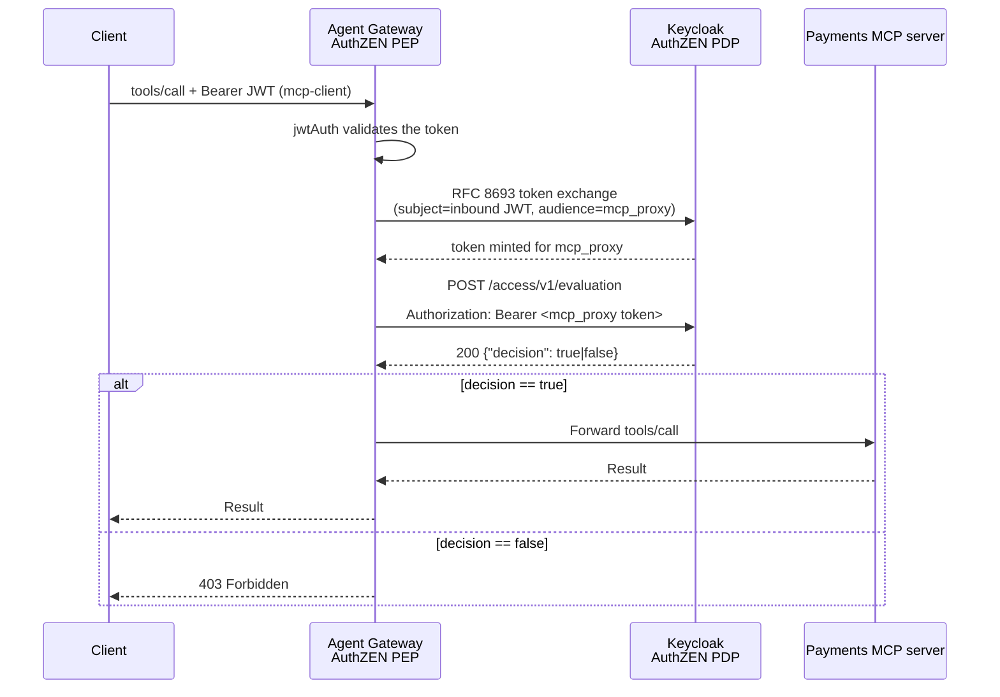

## MCP Tool Authorization with OpenID AuthZEN

[OpenID AuthZEN](https://openid.net/specs/openid-authzen-authorization-api-1_0-ID1.html)
is an emerging standard for externalizing authorization decisions to a Policy
Decision Point (PDP) over a common REST/JSON API. It standardizes communication between Policy Enforcement Points (PEPs) and Policy Decision Points (PDPs). This integration enables MCP deployments to externalize authorization decisions to standards-compliant PDPs, supporting multiple authorization models.

In this demo, Agent Gateway is acting as the
AuthZEN Policy Enforcement Point (PEP) in front of a mock payments MCP
server: for every `tools/call` request it validates the caller's session,
calls the PDP's AuthZEN evaluation endpoint using a simplified mapping between the MCP request and the AuthZEN
request, and only forwards the call if the PDP grants it.

This setup uses the Keycloak IAM platform as both the OpenID Provider and the AuthZEN PDP. Agent Gateway's PEP
integration can use any AuthZEN-compliant PDP.


**Note:** The token exchange is Keycloak-specific. It is only used to authenticate and authorize the Gateway to access the protected AuthZEN API; it is not required by the AuthZEN protocol itself.

The PEP sends an **Evaluation Request** containing information about the subject, resource, and action. The PDP evaluates this request against its policies and returns a **Decision Response** indicating whether the operation should be allowed or denied.

This pattern decouples authorization logic from application code, enabling:

| Benefit | Description |
|---------|-------------|
| **Standardization** | AuthZEN provides a vendor-neutral interface, avoiding PDP lock-in |
| **Externalized Authorization** | Policy decisions decoupled from application code |
| **Fine-Grained Access Control** | Support for ReBAC, PBAC, ABAC, or hybrid models |
| **Policy as Code** | Policies managed as versioned artifacts with audit trails |
| **Centralized Governance** | Consistent policy enforcement across MCP deployments |
| **Dynamic Authorization** | Runtime evaluation of context-aware policies |
| **Interoperability** | Compatible with any AuthZEN-compliant PDP |
| **NIST best practices** | NIST ABAC 800-162 / NIST Zero Trust 800-207 |

### AuthZEN Evaluation Request

The AuthZEN specification defines an evaluation request containing four primary components:

| Component | Description |
|-----------|-------------|
| `subject` | The entity requesting access (user, service, agent) |
| `resource` | The target of the access request |
| `action` | The operation being performed |
| `context` | Additional contextual information |

In this simplified example we apply coarse-grained authorization (CGA) at the tool level with the following mapping:

```json
  {
    "subject": {"type": "user", "id": jwt.sub},
    "resource": {"type": "tool", "id": mcp.tool.name},
    "action": {"name": "tools/call"},
    "context": {"agent": jwt.azp}
  }
```

For more advanced cases for FGFA see [COAZ Binding for the Model Context Protocol](https://openid.github.io/authzen/authzen-coaz-mcp-binding-1_0.html).

### Setup

[`keycloak/bootstrap-authzen.sh`](keycloak/bootstrap-authzen.sh) adds the
roles, users, clients, and AuthZEN resources/policies from the table above.
Keycloak plays both the OpenID Provider and AuthZEN PDP roles here purely
for convenience; either role could be swapped out independently for another
AuthZEN-compliant PDP without changing agentgateway's PEP configuration.

The Payment MCP exposes 5 payments tools; three roles get different
access:

| Role               | list_accounts | get_account | create_payment | approve_payment | cancel_payment |
|--------------------|:-:|:-:|:-:|:-:|:-:|
| `payments_user`    | ✓ | ✓ | ✓ | ✗ | ✗ |
| `payments_manager` | ✓ | ✓ | ✓ | ✓ | ✓ |
| `payments_admin`   | ✓ | ✓ | ✓ | ✓ | ✓ |

Three users are configured: `alice` (`payments_user`), `bob`
(`payments_manager`), `carol` (`payments_admin`).

### Running the example

Start Keycloak, bootstrap the realm and the payments MCP server

```bash
docker compose -f examples/mcp-authzen/docker-compose.yaml up -d
```

Start agentgateway:

```bash
cargo run -- -f examples/mcp-authzen/config.yaml
```

### Use cases

[`cli-tests.sh`](cli-tests.sh) drives one MCP tool call end to end as a given
user (password grant, MCP session handshake, `tools/call`), with sensible
default arguments per tool - run `./cli-tests.sh` with no arguments for the
full usage and examples. It's the easiest way to see the policy in action:

**`alice` (`payments_user`) - read and write, no approval authority.** Alice
can look up accounts and create a payment, since those are the routine
actions of her role, but `approve_payment` requires a role she doesn't hold:

```bash
cd examples/mcp-authzen
./cli-tests.sh alice list_accounts      # 200 - allowed
./cli-tests.sh alice create_payment     # 200 - allowed, creates pay-1
./cli-tests.sh alice approve_payment    # 403 - denied
```

**`bob` (`payments_manager`) - can also approve or cancel.** Bob has
everything Alice has, plus the ability to approve the payment she created,
reflecting the manager role's extra scope in the access table above:

```bash
./cli-tests.sh bob approve_payment      # 200 - allowed, approves pay-1
```

**`carol` (`payments_admin`) - same tool access as manager here.** The admin
role isn't automatically broader than manager - on these five tools, the PDP
grants carol exactly the same access as bob, since the policy is defined
per tool/role pair rather than by a role hierarchy:

```bash
./cli-tests.sh carol cancel_payment '{"payment_id":"pay-1"}'   # 200 - allowed
```

What to notice:

- The `403` for alice never reaches the payments server - agentgateway's
  `authorization` policy rejects it from Keycloak's `decision: false`
  *before* the request is proxied anywhere.
- Every other call (both allows and denies) goes through the same code path;
  only the AuthZEN decision for `{subject: <user>, resource: <tool>, action:
  "tools/call"}` changes, driven entirely by Keycloak policies, nothing
  tool-specific is hardcoded in agentgateway's config.
- `initialize` and `tools/list` always succeed regardless of role, since
  `extAuthz` only fires when `mcp.tool` is set (i.e. on `tools/call`).

### References

- [AuthZEN Authorization API 1.0](https://openid.net/specs/openid-authzen-authorization-api-1_0-ID1.html)
- [AuthZEN CoAZ MCP binding](https://openid.github.io/authzen/authzen-coaz-mcp-binding-1_0.html)
