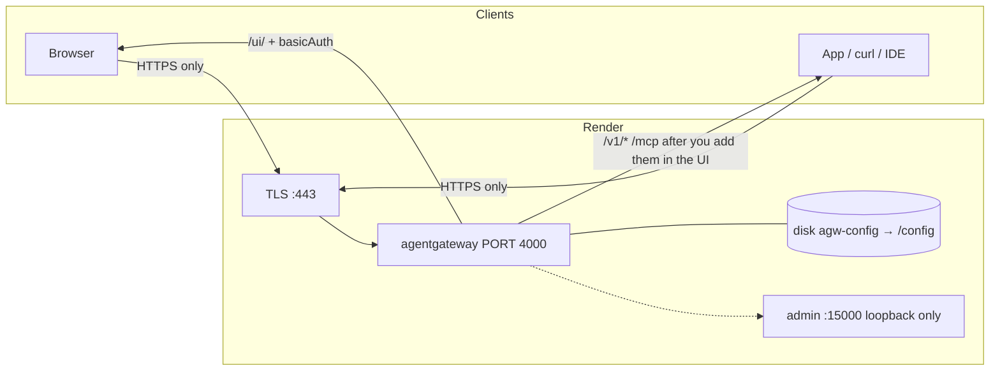

## Render Deploy Example

This example deploys standalone agentgateway on [Render](https://render.com) as a Docker web service with a public **HTTPS** URL.

Render terminates TLS on `:443` and forwards to the container’s `PORT=4000`. Do not publish `:4000` yourself, and do not call the service over `http://`.

The Blueprint file is [`render.yaml`](./render.yaml) in this folder. Render looks for `render.yaml` at the **repo root** by default, so you have to point it at this subdirectory:

| How you create the service | Where to put that path |
|----------------------------|------------------------|
| [Deploy to Render](https://render.com/deploy?repo=https://github.com/agentgateway/agentgateway&path=examples/render-deploy/render.yaml) button | Query param `path=examples/render-deploy/render.yaml` |
| Dashboard → New Blueprint | **Blueprint Path** = `examples/render-deploy/render.yaml` |

[](https://render.com/deploy?repo=https://github.com/agentgateway/agentgateway&path=examples/render-deploy/render.yaml)

`dockerfilePath` / `dockerContext` inside the YAML stay relative to the **repo root** (`./examples/render-deploy/Dockerfile`), even though the Blueprint file lives under `examples/render-deploy/`.

The image this service builds is this folder’s [`Dockerfile`](./Dockerfile): a thin wrapper around the official `cr.agentgateway.dev/agentgateway` image. The wrapper writes `/config/.htpasswd` on every start, seeds a UI-only `config.yaml` on first boot, chowns the disk, then drops to uid 65532 — the gateway itself does not run as root. Add LLM models and MCP servers in the UI after login. Do **not** pick **Existing Image** → `cr.agentgateway.dev/agentgateway:v1.5.0`. Empty `/config` auto-gen serves `/ui/` with **no auth**.

## Architecture

Render gives you **one** public port. UI, LLM, and MCP therefore share `gateways.default` on `:4000` and split by path. Admin `:15000` is loopback-only inside the container. Config, htpasswd, and SQLite live on disk **`agw-config`** mounted at **`/config`**.



| Public path | Who it is for | Auth |
|-------------|----------------|------|
| `/ui/` | Operators | HTTP basic (`UI_USER` / `UI_PASSWORD`) |
| `/v1/*` | Apps, playground, `curl` | Whatever you configure in **LLM** (none until you add a model) |
| `/mcp` | MCP clients | Whatever you configure in **MCP** (none until you add a server) |

`ui.policies` does **not** cover `/v1/*`. Do not send the UI password as an LLM Bearer token.

| Fact | Value |
|------|--------|
| Service | Web Service, Docker, **0.5c-512mb** |
| URL | `https://<your-service>.onrender.com` — **HTTPS only** |
| Disk | **`agw-config`** → **`/config`**, 1 GB |
| UI | `/ui/` basic auth via `UI_USER` + `UI_PASSWORD` |
| LLM / MCP | Add in the UI after login |
| Database | SQLite on the disk. Optional: [Render Postgres](https://render.com/docs/postgresql-creating-connecting) — point `config.database.url` at the connection string in the UI |
| Admin | `:15000` on `127.0.0.1` — not on the internet |

First-boot config (same shape as [`config.example.yaml`](./config.example.yaml)):

```yaml
config:
  database:
    url: sqlite:///config/data.db
gateways:
  default:
    port: 4000
ui:
  gateways: [default]
  policies:
    basicAuth:
      mode: strict
      htpasswd:
        file: /config/.htpasswd
      realm: agentgateway
```

## Environment variables

Set these in the Render **Environment** tab. Never commit real values. See [`.env.example`](./.env.example).

| Variable | Required | Purpose |
|----------|----------|---------|
| `PORT` | **Yes** | Must be `4000`. Render proxies `$PORT` (default `10000`); the gateway listens on 4000. |
| `UI_USER` | No | Basic-auth username. Default `admin`. Letters, digits, `.`, `_`, `@`, `-` only. |
| `UI_PASSWORD` | **Yes** | Entrypoint writes `/config/.htpasswd` every start. Process exits 1 if unset. |

Provider keys (`OPENAI_API_KEY`, `ANTHROPIC_API_KEY`, `GITHUB_PERSONAL_ACCESS_TOKEN`, `DATABASE_URL`) are optional. Add them later if a model or MCP target you create in the UI references `$THAT_VAR`. The Blueprint does not prompt for them: `sync: false` would make Render require a value, and agentgateway exits if `config.yaml` expands a `$VAR` that is unset.

## How to deploy

### 1. Create the Render web service

Use the button above, or Dashboard → New Blueprint with **Blueprint Path** `examples/render-deploy/render.yaml`. From a fork, point the Blueprint at that fork.

**Manual** — New → Web Service → this repo, Docker, `./examples/render-deploy/Dockerfile`, context `./examples/render-deploy`. Do **not** pick **Existing Image** → `cr.agentgateway.dev/agentgateway:v1.5.0`.

Pushes to the linked branch auto-deploy when `examples/render-deploy/` changes (`autoDeployTrigger: commit` + `buildFilter`). Other folders in this repo do not rebuild the service. Do not also set `autoDeploy` — Render rejects a Blueprint that includes both.

### 2. Set the env vars

Render prompts for `UI_PASSWORD` on first Blueprint create. Pin `PORT=4000`. Generate the password in the dashboard.

### 3. Disk

The Blueprint already declares **`agw-config`** → **`/config`**, 1 GB. Disks are not available on Render Free — **0.5c-512mb** is the floor (Render still accepts `starter` as an alias). Without the volume, config and analytics reset on every deploy.

### 4. Deploy

First boot writes `.htpasswd` + a UI-only `config.yaml`, chowns `/config` to uid 65532, then execs the gateway as that uid. In Render logs you want:

- `entrypoint: seeded /config/config.yaml (ui basicAuth)`
- `state_manager Watching config file: /config/config.yaml`
- `app serving UI at http://localhost:4000/ui`
- `proxy::gateway started bind bind="bind/4000"`
- admin on `127.0.0.1:15000`
- `==> Your service is live`

If an earlier revision of this example wrote lab `llm` / `mcp` placeholders (`$OPENAI_API_KEY`), the entrypoint replaces that file with the UI-only seed so the process can boot. Models you added in the UI are left alone unless they still reference those lab placeholders.

A `http.status=401` on `/ui/` with `basic authentication failure: no basic authentication credentials found` is success. Health checks must **not** `GET /ui/` (401 ≠ healthy). The Blueprint omits `healthCheckPath` so Render uses TCP on `:4000`.

### 5. Open the UI over HTTPS

```
https://<your-service>.onrender.com/ui/
```

Browser basic-auth prompt: `UI_USER` / `UI_PASSWORD`. Gateway Overview shows Traffic on gateway **default**. Add models under **LLM → Models** and servers under **MCP → Servers**. If a field asks for an env var (`$OPENAI_API_KEY`, `$GITHUB_PERSONAL_ACCESS_TOKEN`, …), set that var in the Render Environment tab first.

## Ports and limits

Render publishes **HTTPS :443** to one container port. That port is `4000`. There is no public `:4000` URL and no public admin.

| Address | Reachable from the internet? |
|---------|------------------------------|
| `https://<service>.onrender.com/ui/` | Yes, basic auth |
| `https://<service>.onrender.com/v1/*` | Yes, after you add an LLM model |
| `https://<service>.onrender.com/mcp` | Yes, after you add an MCP server |
| `http://<service>.onrender.com/...` | Do not use |
| `:4000` on the public hostname | Do not use |
| `:15000` | No — loopback only |

0.5c-512mb is enough for a demo. The disk is the persistence story.

## Security

`ui.policies.basicAuth` `mode: strict` plus file htpasswd (`$2y$` bcrypt at cost 10, rewritten every start via `htpasswd -B`). Unauthenticated `GET /ui/` is **401** and `WWW-Authenticate: Basic realm="agentgateway"`.

That is **demo-grade** behind Render TLS. It is not an IdP.

- Rotate `UI_PASSWORD` and any provider keys if this URL is more than a lab.
- HTTP basic is not SSO, however strong the hash.

Inline bcrypt in `config.yaml` is a footgun: hashes contain `$`, and agentgateway env-expands `$VARS`. A file-backed htpasswd is read as raw bytes with no expansion, which is why the entrypoint writes one.

`config.yaml` and `.htpasswd` are both created mode `600` and owned by uid 65532.

## Verify

HTTPS only.

```sh
HOST=https://<your-service>.onrender.com

# UI locked
curl -sI "$HOST/ui/" | grep -E 'HTTP/|www-authenticate'
# HTTP/2 401
# www-authenticate: Basic realm="agentgateway"

curl -sI -u "$UI_USER:$UI_PASSWORD" "$HOST/ui/" | head -5
# HTTP/2 200
```

A 401 on `/ui/` without credentials and a 200 with them is the smoke test. LLM and MCP checks depend on what you added in the UI.
